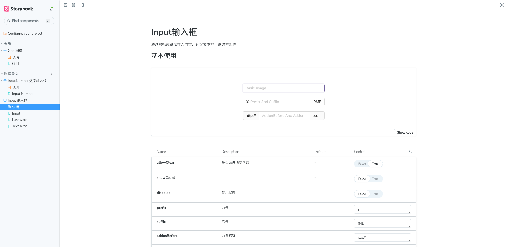

# sd-design


## 简介

`sd-design` 是一个基于 OWL 框架构建的 UI 组件库，旨在满足国内用户对 Odoo UI 的审美和使用需求。本项目启发于 `ant-design`，旨在提供更加美观和易用的 UI 组件，以优化用户体验。

## 特点

- **美观**: 参照 [ant-design](https://github.com/ant-design/ant-design)，`sd-design` 提供了符合国内用户审美的 UI 设计。
- **易用性**: 提供简洁明了的 API，使得组件易于集成和使用。
- **灵活性**: 组件可高度自定义，满足不同场景下的需求。
- 完全开源使用，不会有商业版等区别对待

## 预览图



## 快速开始

### 本地运行
```bash
yarn install

yarn run storybook
```

## 说明文档

- 文档采用storybook编写，可在本地运行查看。
- 线上storybook：待补充

## 贡献

欢迎对 sd-design 提出宝贵意见或贡献代码。请遵循以下步骤进行贡献：

1. Fork 本仓库
2. 创建您的特性分支 (`git checkout -b feat/AmazingFeature`)
3. 提交您的更改 (`git commit -m 'Add some AmazingFeature'`)
4. 推送到远程分支 (`git push origin feat/AmazingFeature`)
5. 开启一个 Pull Request。

## 许可
该项目采用 MIT 许可证进行授权。查看 [LICENSE](./LICENSE) 获取更多信息。

## 附言

目前，`sd-design` 项目仍处于发展阶段，我们只提供了部分核心组件。我们计划未来逐步扩充和完善这个组件库，以更好地满足用户需求。由于目前团队规模较小，我们的更新和迭代速度可能不会很快，但我们致力于保持项目的持续发展和改进。
我们非常欢迎社区的任何建议、反馈或贡献。如果您对 `sd-design` 有任何建议或意见，欢迎通过提出 issue 来分享您的想法。同时，如果您希望加入到讨论中或对项目有更深入的了解，欢迎加入我们的微信群进行交流。
您的支持和理解对我们至关重要，这将帮助我们不断进步，使 `sd-design` 成为更优秀的 UI 组件库。

## 联系方式

如果您有任何问题或建议，请通过以下方式联系我们：

- 再仓库中提交issue
- 微信联系进群讨论：
  
